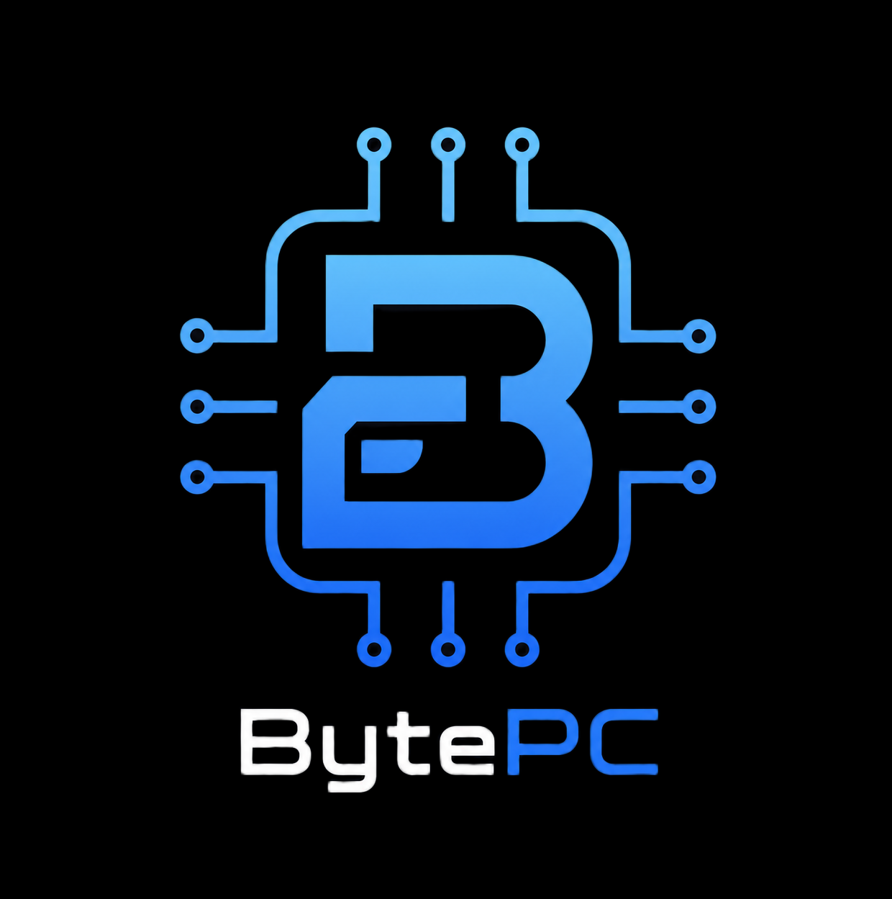
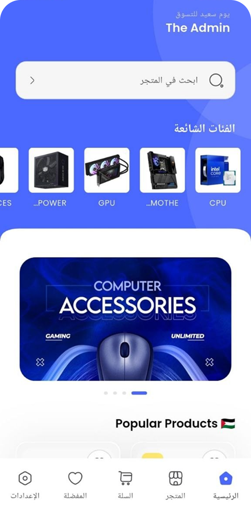

# BytePC

---

<h3>فكرة التطبيق</h3>

#

BytePC
  هو نموذج لتطبيق متجر متخصص في بيع وتجميع قطع الكمبيوتر.
الفكرة كانت تقديم تجربة استخدام بسيطة، سريعة، ومريحة، بحيث يقدر أي مستخدم يتصفح المنتجات ويصل لما يحتاجه بسهولة بدون تعقيد أو ازدحام داخل الواجهة.

---

<h3>صور من التطبيق</h3>

#

---

## ماذا ستجد داخل التطبيق؟

✔️ واجهات حديثة وبسيطة

✔️ تجربة استخدام سهلة وسريعة

✔️ عرض منظم للمنتجات

✔️ البحث والوصول للمنتجات بسهولة

✔️ صفحة تفاصيل لكل منتج

✔️ سلة مشتريات

✔️ قائمة مفضلة

✔️ ملف شخصي للمستخدم

✔️ تصميم متناسق في جميع الصفحات

#

## لماذا صنعت هذا المشروع؟

أؤمن أن التطبيق الناجح ليس مجرد ألوان جميلة أو شاشات كثيرة، بل تجربة تجعل المستخدم يشعر بالراحة منذ أول ثانية.

لهذا كان التركيز في BytePC على البساطة، والتنظيم، والاهتمام بالتفاصيل الصغيرة التي تصنع فرقًا حقيقيًا في تجربة الاستخدام.

#

## معرض إضافي

---

## هل لديك فكرة تطبيق؟

إذا كان لديك مشروع أو فكرة وتبحث عن تنفيذ احترافي يهتم بالتفاصيل ويقدم تجربة استخدام مميزة، يسعدني العمل معك وتحويل فكرتك إلى تطبيق حقيقي.

شكرًا لزيارتك، وأتمنى أن ينال المشروع إعجابك ❤️
